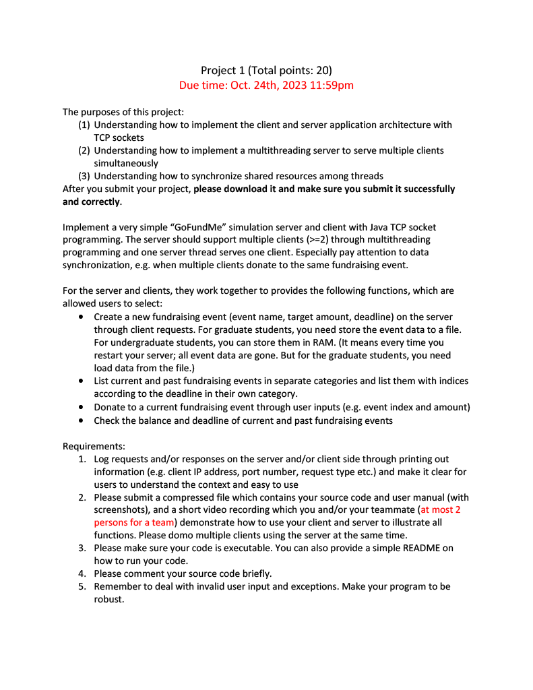

# CSCI-455-Project-1-Client
This is the client application for project 1 for CSCI 455

[Server application](https://github.com/brandon57/CSCI-455-Project-1-Server)

# These are the requirements for the project
<p align="center">
  
</p>

<p align="center">
  
</p>

# Files needed to run the Server and Client

# How to start the server
In order to run the server you need to open the command line or powershell and navigate to the directory of where the file is located.
Once you do that you can start the program by typing this command `java -jar Server.jar`

Once you do that you this should pop up
```text
Opening Socket
Socket is open
```
Seeing this means that the server is now running and waiting for users to connect.

# How to start the client
The way to start the client is the same as the server except you'll get a different screen when it starts.
This is what you should get when you start the client application.
```text
What do you want to do?
1. Connect to GoFundMe
2. Exit
```
Once you get this you can type 1 or connect to connect to the server or you can type 2 or exit to close the program.

If you decide to connect you be greated with this screen.
```text
You are connected!

---------------------------------------------------------------------------------
Here are on going funderaisers:
1. John's college fund | raised: $0 | goal: $1000 | deadline: 10/30/2023 |
---------------------------------------------------------------------------------
These are the options you have to chose from
1. See current funderaisers
2. See past funderaisers
3. Create a funderaiser
4. Donate to a funderaiser
5. Refresh
6. Exit
```
Once you get to this screen you are free to navigate the server.

# Navigating the menus
The way to navigate the server is by typing the number next to the option or typing the key word of the option.
An example of this is to either enter 2 or the word past in order to see past fundraisers.
```text
input: past
Result:
---------------------------------------------------------------------------------
Here are past funderaisers:
1. Wedding | raised: $0 | goal: $10000 | ended: 11/20/2022 |
---------------------------------------------------------------------------------
These are the options you have to chose from
1. See current funderaisers
2. See past funderaisers
3. Create a funderaiser
4. Donate to a funderaiser
5. Refresh
6. Exit
```
